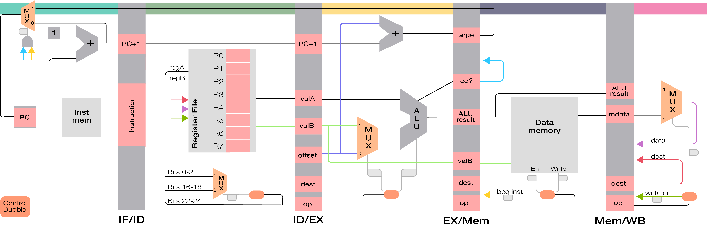
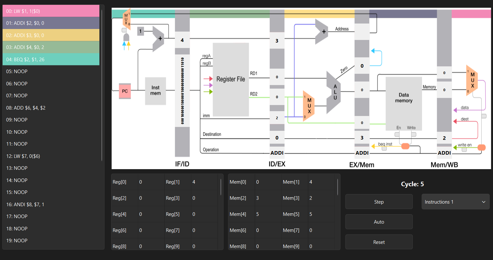
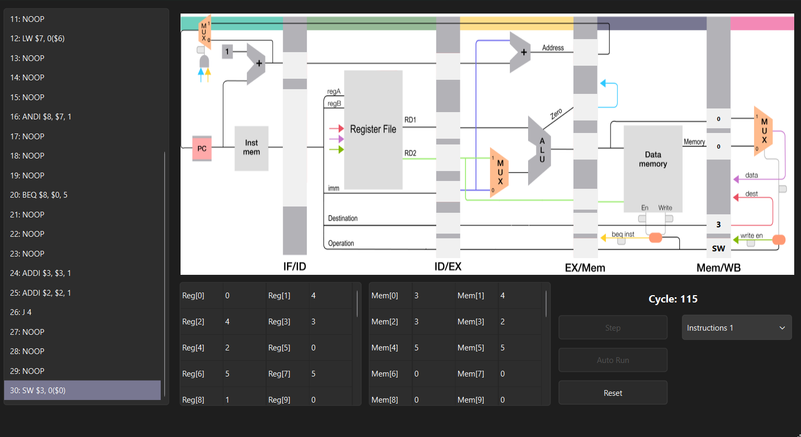
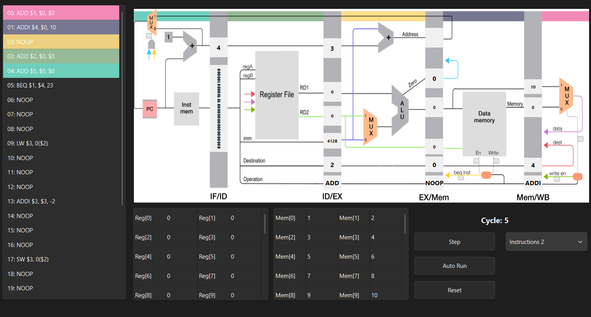

# MIPS Pipeline CPU Simulator

This project showcases a **software simulator of a MIPS CPU architecture using pipelined execution**.  
The application models how instructions flow through a 5-stage pipeline and allows users to observe execution behavior, control signals, and performance in a RISC processor.

The simulator enables step-by-step execution, visualization of registers and memory, and analysis of hazards and pipeline efficiency.

  
  
  
  

## 🚀 Features

* 🧠 **Pipeline Simulation**
  * Full 5-stage pipeline (IF, ID, EX, MEM, WB)
  * Parallel execution of instructions
  * Cycle-by-cycle simulation

* 📊 **Execution Visualization**
  * Register values updated in real-time
  * Memory state tracking
  * Pipeline stage monitoring

* ⚠️ **Hazard Handling**
  * Data hazard simulation using NOPs
  * Control hazard handling for branches and jumps

* 🧮 **Instruction Support**
  * R-type: add, sub, and, or, slt, sll, srl, sra  
  * I-type: addi, andi, ori, lw, sw, beq  
  * J-type: j  

* 🎮 **Execution Control**
  * Step-by-step execution
  * Automatic run mode
  * Reset functionality

## 🛠️ Tech Stack

* C++  
* STL (bitset, vectors)  
* Visual Studio (2019/2022)  
## 🎮 Controls
| Action       | Description                |
| ------------ | -------------------------- |
| Step         | Execute one clock cycle    |
| Auto Run     | Run continuously           |
| Reset        | Reset registers and memory |
| Load Program | Load instruction file      |

## 🧠 Technical Highlights
**Pipeline Architecture** 

* The simulator implements a classic 5-stage MIPS pipeline:
  * IF – Instruction Fetch
  * ID – Instruction Decode
  * EX – Execute (ALU)
  * MEM – Memory Access
  * WB – Write Back

* Uses pipeline registers:
  * IF/ID
  * ID/EX
  * EX/MEM
  * MEM/WB

**Control Unit**

* Generates signals:
  * RegDst
  * ALUSrc
  * MemWrite
  * MemtoReg
  * RegWrite
  * Branch / Jump
  * ALUOp

* Signals propagate through all pipeline stages

**Hazard Simulation**
* Data Hazards
* Managed using inserted NOP instructions
* Simulates pipeline stalling
* Control Hazards
* Branch decision affects PC update
* Pipeline flushing behavior simulated

**Performance Analysis**
* Non-pipelined execution: 5 × N cycles
* Pipelined execution: 5 + (N - 1) cycles

**Memory & Registers**
* 32 general-purpose registers
* Instruction memory (32-bit instructions)
* Data memory (32-bit values)
* Program Counter (PC) management

## 👤 Author

Souca Vlad-Cristian

Faculty of Automation and Computer Science

Technical University of Cluj-Napoca
